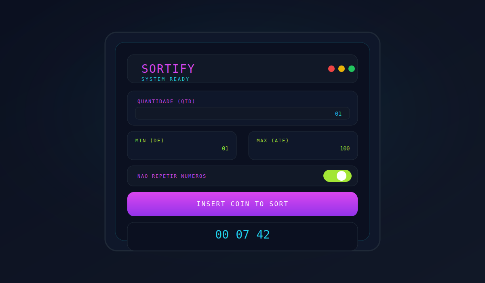

<div align="center">
  
  <h1>🎮 Sortify</h1>
  <p>Gerador de números aleatórios com estética arcade, animações CRT e foco em UX.</p>
  <p>
    
    
    
    
  </p>
</div>

## 📌 Índice
- [Sobre o Projeto](#sobre-o-projeto)
- [Demo](#demo)
- [Funcionalidades](#funcionalidades)
- [Tecnologias](#tecnologias)
- [Conceitos Aplicados](#conceitos-aplicados)
- [Destaques Técnicos](#destaques-tecnicos)
- [Responsividade](#responsividade)
- [Design System](#design-system)
- [Estrutura do Projeto](#estrutura-do-projeto)
- [Instalação](#instalacao)
- [Como Usar](#como-usar)
- [Roadmap](#roadmap)
- [Aprendizados](#aprendizados)
- [Contribuições](#contribuicoes)
- [Autor](#autor)

## 💡 Sobre o Projeto
Sortify é um sorteador de números com tema arcade que permite configurar quantidade, intervalo e modo sem repetição. O objetivo é praticar lógica de sorteio, validações matemáticas e construção de uma interface com identidade visual forte usando apenas HTML, CSS e JavaScript.

Este projeto demonstra tecnicamente:
- 🎯 Organização de estado e fluxo de eventos (init, bind, render).
- 🎲 Lógica de sorteio com regras consistentes e validações robustas.
- ✨ UI rica em microinterações (glitch, scanlines, loader, efeitos neon).
- 🧩 Design system com tokens, tipografia fluida e componentes isolados.

Foco em habilidades: DOM, validação de dados, animações CSS, acessibilidade e arquitetura modular.

## 🎬 Demo
**Deploy:** Em breve

**Preview da interface:**



## ✨ Funcionalidades
### Core Features
- ✅ 🎲 Sorteio de múltiplos números com intervalo configurável.
- ✅ 🎛️ Controle de QTD, mínimo e máximo em tempo real.
- ✅ 🔁 Opção de sorteio sem repetição.
- ✅ ⚡ Animação de rolagem com efeito CRT/glitch.
- ✅ 🧩 Loader inicial com progresso e feedback visual.

### Validações e UX
- ✅ 🧠 Validação de números obrigatórios e consistentes.
- ✅ 🧮 Bloqueio de combinações impossíveis no modo único.
- ✅ ⛔ Modal de erro customizado para mensagens claras.
- ✅ 🧼 Sanitização de inputs para aceitar apenas dígitos.
- ✅ ♿ Feedback acessível com `aria-live` e labels semânticos.

## 🚀 Tecnologias
### Frontend
- HTML5
- CSS3 (Custom Properties, Animations, `color-mix`)
- JavaScript ES6+ (Vanilla)

### Backend
- Não se aplica (projeto 100% frontend).

### Ferramentas
- Google Fonts (Press Start 2P, Share Tech Mono)
- Unicorn Studio (background animado)
- Git/GitHub

## 🧠 Conceitos Aplicados
### JavaScript
- ✅ Manipulação de DOM e cache de elementos.
- ✅ Gerenciamento de estado local com objeto `state`.
- ✅ Sanitização e validação de inputs.
- ✅ Timers (`setInterval`/`setTimeout`) para animações.
- ✅ Geração de números aleatórios com intervalo inclusivo.
- ✅ Renderização dinâmica e controle de reflow.
- ✅ Acessibilidade: feedback em `aria-live`.

### CSS
- ✅ Tokens com CSS Custom Properties.
- ✅ Tipografia fluida via `clamp()`.
- ✅ Layouts com Flexbox e Grid.
- ✅ Animações e keyframes (glitch, pulse, scanlines).
- ✅ Glassmorphism com `backdrop-filter`.
- ✅ Gradientes e iluminação neon com `color-mix()`.
- ✅ Componentização por arquivos e escopo.

### Arquitetura
- ✅ Separação de responsabilidades (Loader vs Sorteio).
- ✅ Organização modular de CSS (`global`, `app`, `components`).
- ✅ Convenção de classes BEM-like para previsibilidade.
- ✅ Componentes desacoplados (modal, toggle, resultados).

<a id="destaques-tecnicos"></a>
## 🎯 Destaques Técnicos
### 1) Loader com progresso sincronizado
```javascript
const LoadingSystem = {
  // Estado central do loader
  state: {
    progress: 0,
    isComplete: false,
  },
  config: {
    duration: 3000,
    jumpInterval: 1200,
  },
  elements: {
    overlay: document.getElementById("app-loader"),
    percentText: document.getElementById("loader-percent"),
    barFill: document.getElementById("loader-bar"),
    block: document.getElementById("loader-block"),
  },
  init() {
    this.startProgress();
    this.startAnimationSync();
  },
};
```
**Por que essa abordagem?** Centralizar estado e elementos evita duplicação e garante sincronismo entre barra, porcentagem e animação.
- Reduz acoplamento entre UI e lógica.
- Facilita ajustes de tempo (durations) em um único lugar.
- Mantém as animações consistentes mesmo em devices mais lentos.

### 2) Validação de regras do sorteio
```javascript
validate() {
  const { amount, min, max, noRepeat } = this.state;

  // Regra 1: valores numéricos válidos
  if (isNaN(amount) || isNaN(min) || isNaN(max)) {
    this.showAlert("Por favor, preencha todos os campos com números válidos.");
    return false;
  }

  // Regra 2: quantidade mínima
  if (amount < 1) {
    this.showAlert("Você precisa sortear pelo menos 1 número.");
    return false;
  }

  // Regra 3: intervalo consistente
  if (min >= max) {
    this.showAlert("O valor 'Mínimo' deve ser estritamente menor que o 'Máximo'.");
    return false;
  }

  // Regra 4: evitar extrapolação no modo único
  if (noRepeat) {
    const totalAvailable = max - min + 1;
    if (amount > totalAvailable) {
      this.showAlert(
        `Erro Matemático: Você pediu ${amount} números únicos, mas o intervalo ${min}-${max} só possui ${totalAvailable} opções disponíveis.`
      );
      return false;
    }
  }

  return true;
}
```
**Como funciona?** As regras são avaliadas em sequência e qualquer falha interrompe o fluxo, priorizando feedback imediato ao usuário.
- Evita estados inconsistentes antes do sorteio.
- Garante coerência matemática no modo “sem repetição”.
- Mantém as mensagens de erro claras e contextualizadas.

### 3) Sorteio com efeito glitch e renderização final
```javascript
draw() {
  const { amount, min, max, noRepeat } = this.state;
  const { resultArea } = this.elements;
  const screen = document.querySelector(".results__screen");

  // Pré-render: placeholders e estado inicial
  resultArea.innerHTML = "";
  this.state.results = [];
  for (let i = 0; i < amount; i++) {
    const placeholder = document.createElement("div");
    placeholder.classList.add("result-value");
    placeholder.innerText = "--";
    resultArea.appendChild(placeholder);
  }

  // Efeito visual de rolagem/CRT
  screen.classList.add("is-rolling");
  if (!screen.querySelector(".scanlines")) {
    const scan = document.createElement("div");
    scan.classList.add("scanlines");
    screen.appendChild(scan);
  }

  // Ruído visual enquanto sorteia
  const chaosInterval = setInterval(() => {
    const slots = resultArea.querySelectorAll(".result-value");
    const chars = "0123456789X$#@&%";
    slots.forEach((slot) => {
      slot.innerText =
        chars[Math.floor(Math.random() * chars.length)] +
        chars[Math.floor(Math.random() * chars.length)];
    });
  }, 50);

  // Sorteio real com ou sem repetição
  const finalNumbers = [];
  if (noRepeat) {
    while (finalNumbers.length < amount) {
      const num = this.randomNumber(min, max);
      if (!finalNumbers.includes(num)) finalNumbers.push(num);
    }
  } else {
    for (let i = 0; i < amount; i++) {
      finalNumbers.push(this.randomNumber(min, max));
    }
  }
  this.state.results = finalNumbers;

  // Finalização com flash + render
  setTimeout(() => {
    clearInterval(chaosInterval);
    screen.classList.remove("is-rolling");
    screen.classList.add("flash-effect");
    this.render();
  }, 1000);
}
```
**Por que essa abordagem?** Separa a “ilusão visual” do sorteio real, garantindo clareza e performance.
- Placeholder + glitch geram expectativa antes do resultado final.
- Evita reflows desnecessários ao calcular tudo antes de renderizar.
- Entrega feedback visual mesmo para sorteios rápidos.

### 4) Design tokens e tipografia fluida
```css
:root {
  /* Fontes principais */
  --ff-base: "Share Tech Mono", ui-monospace, SFMono-Regular, monospace;
  --ff-pixel: "Press Start 2P", ui-sans-serif, system-ui, sans-serif;

  /* Tipografia fluida */
  --fs-0: clamp(0.95rem, 0.9rem + 0.25vw, 1.1rem);
  --fs-1: clamp(1.1rem, 1rem + 0.6vw, 1.6rem);
  --fs-2: clamp(1.35rem, 1.1rem + 1vw, 2.1rem);

  /* Espaçamento e raio */
  --space-1: clamp(0.5rem, 0.35rem + 0.6vw, 0.85rem);
  --space-2: clamp(0.75rem, 0.55rem + 0.8vw, 1.15rem);
  --radius-1: clamp(0.6rem, 0.5rem + 0.4vw, 0.9rem);
  --radius-2: clamp(0.9rem, 0.75rem + 0.6vw, 1.25rem);

  /* Cores base */
  --c-bg: hsl(222 47% 6%);
  --c-text: hsl(0 0% 98%);
  --c-cyan: hsl(188 89% 55%);
}
```
**Como funciona?** Tokens centralizam decisões visuais e evitam valores mágicos espalhados.
- Escalas fluidas mantêm legibilidade em qualquer largura de tela.
- Facilita manutenção e ajustes de tema.
- Reforça consistência em todos os componentes.

### 5) Modal com glassmorphism e foco no alerta
```css
.modal-overlay {
  position: fixed;
  inset: 0;
  z-index: 10000;
  display: flex;
  align-items: center;
  justify-content: center;
  background-color: rgba(5, 5, 10, 0.4);
  backdrop-filter: blur(12px);
  opacity: 0;
  visibility: hidden;
  transition: all 0.4s cubic-bezier(0.32, 0.72, 0, 1);
}

.modal-overlay.active {
  opacity: 1;
  visibility: visible;
}

.modal-box {
  width: min(90%, 400px);
  background: rgba(20, 20, 30, 0.7);
  border: 1px solid rgba(255, 255, 255, 0.08);
  border-radius: 24px;
  box-shadow: 0 20px 40px -10px rgba(0, 0, 0, 0.6);
  transform: translateY(20px) scale(0.95);
  opacity: 0;
  transition: all 0.4s cubic-bezier(0.34, 1.56, 0.64, 1);
}

.modal-overlay.active .modal-box {
  transform: translateY(0) scale(1);
  opacity: 1;
}
```
**Por que essa abordagem?** O overlay garante foco total no alerta sem perder a estética do layout.
- Glassmorphism reforça a identidade futurista.
- Transições suaves evitam mudanças abruptas.
- Mantém a mensagem centralizada e fácil de ler.

## 📱 Responsividade
A base é mobile-first: o layout nasce para telas menores e cresce com espaçamentos fluidos. A tipografia usa `clamp()` para manter legibilidade sem depender de dezenas de media queries. Abaixo está um **exemplo de breakpoints sugeridos** caso queira ajustar o layout para telas maiores.

```css
/* Mobile-first: 1 coluna por padrão */
.sort-form__row {
  grid-template-columns: 1fr;
}

@media (min-width: 540px) {
  .sort-form__row {
    grid-template-columns: 1fr 1fr;
  }
  .results__content {
    gap: var(--space-3);
  }
}

@media (min-width: 768px) {
  .arcade__panel {
    padding: var(--space-4);
  }
  .btn {
    font-size: clamp(0.9rem, 0.8rem + 0.4vw, 1.1rem);
  }
}
```
**Abordagem:** poucos breakpoints, muita fluidez. O container já usa `min(34rem, 92vw)` para evitar overflow e manter o conteúdo confortável.

## 🎨 Design System
### Paleta de cores
```css
:root {
  --c-bg: hsl(222 47% 6%);
  --c-surface: hsl(222 30% 12%);
  --c-surface-2: hsl(222 28% 16%);
  --c-text: hsl(0 0% 98%);
  --c-muted: hsl(215 20% 65%);
  --c-cyan: hsl(188 89% 55%);
  --c-fuchsia: hsl(292 84% 60%);
  --c-lime: hsl(84 84% 55%);
  --border-1: 1px solid hsl(215 25% 25%);
}
```

### Tokens principais
| Categoria | Token | Valor | Uso |
| --- | --- | --- | --- |
| Espaçamento | `--space-1` | `clamp(0.5rem, 0.35rem + 0.6vw, 0.85rem)` | gaps menores |
| Espaçamento | `--space-2` | `clamp(0.75rem, 0.55rem + 0.8vw, 1.15rem)` | blocos e botões |
| Espaçamento | `--space-3` | `clamp(1rem, 0.75rem + 1vw, 1.5rem)` | seções principais |
| Espaçamento | `--space-4` | `clamp(1.25rem, 1rem + 1.2vw, 2rem)` | respiro macro |
| Raio | `--radius-1` | `clamp(0.6rem, 0.5rem + 0.4vw, 0.9rem)` | inputs e toggles |
| Raio | `--radius-2` | `clamp(0.9rem, 0.75rem + 0.6vw, 1.25rem)` | painéis e botões |
| Sombra | `--shadow-1` | `0 0.75rem 2.5rem hsl(0 0% 0% / 0.55)` | elevação |
| Layout | `--container-max` | `min(34rem, 92vw)` | largura máxima |

### Efeitos especiais
- **Glassmorphism:** `backdrop-filter` no cabinet e no modal para profundidade.
- **Gradientes neon:** marca e botões com glow e text shadow.
- **CRT/scanlines:** textura de tela simulada em `.results__screen`.

## 📁 Estrutura do Projeto
```text
.
├── assets/ 🖼️
│   ├── sortify-logo.svg
│   └── sortify-preview.svg
├── index.html 🧱
├── scripts.js ⚙️
├── styles/ 🎨
│   ├── index.css
│   ├── global.css
│   ├── app.css
│   └── components/
│       ├── arcade.css
│       ├── form.css
│       ├── button.css
│       ├── results.css
│       ├── modal.css
│       └── loader.css
└── README.md 📘
```
**Organização modular:** `styles/index.css` importa os módulos e cada componente possui seu arquivo dedicado para facilitar manutenção e evolução.

<a id="instalacao"></a>
## 🔧 Instalação
**Pré-requisitos:**
- Git para clonar o repositório.
- Navegador moderno (Chrome, Firefox, Edge).
- Python 3 ou PHP para servidor local (opcional).

**Passos:**
```bash
# 1) Clone o repositório
git clone <URL_DO_REPO>
# 2) Entre na pasta do projeto
cd Sortify
# 3) (Opcional) Suba um servidor local com Python
python3 -m http.server 5173
# 4) Abra o navegador no endereço
# http://localhost:5173
# 5) Alternativa com PHP, se preferir
php -S localhost:5173
# 6) Pare o servidor com Ctrl+C
```

**Deploy:**
- **GitHub Pages:** Settings → Pages → Deploy from branch → `main` / root.
- **Vercel:** Importar repositório → Framework “Other” → Deploy.

## 📖 Como Usar
1. Defina a **Quantidade (QTD)** de números.
2. Configure **Min (de)** e **Max (até)**.
3. Ative **Não repetir números** caso precise de resultados únicos.
4. Clique em **Insert Coin to Sort** e aguarde a animação.
5. Consulte os resultados exibidos no painel.


## 🗺️ Roadmap
### v1.1
- [ ] Histórico de sorteios com `localStorage`.
- [ ] Exportação de resultados (CSV).
- [ ] Seed opcional para sorteios reproduzíveis.
- [ ] Melhorias de acessibilidade no modal (foco e teclado).

### v2.0
- [ ] Sorteio por listas (nomes/itens).
- [ ] Temas customizáveis com troca de paleta.
- [ ] Compartilhamento por link com parâmetros.
- [ ] Painel de estatísticas e frequência.

## 🎓 Aprendizados
- **JavaScript:** organização de estado, validação e renderização dinâmica.
- **CSS:** tokens, animações complexas e efeitos visuais temáticos.
- **UX/UI:** feedback contínuo, consistência visual e legibilidade.
- **Acessibilidade:** boas práticas de aria e hierarquia semântica.

<a id="contribuicoes"></a>
## 🤝 Contribuições
1. Faça um fork do projeto.
2. Crie uma branch para sua feature (`git checkout -b feature/minha-feature`).
3. Commit suas mudanças (`git commit -m "feat: minha feature"`).
4. Envie para o repositório remoto (`git push origin feature/minha-feature`).
5. Abra um Pull Request explicando a melhoria.

## 👨‍💻 Autor
<div align="center">
  
  <h3>Horacio Junior</h3>
  <p>
    <a href="https://www.linkedin.com/in/júnior-almeida-3563a934b/">
      
    </a>
    <a href="https://github.com/juninalmeida">
      
    </a>
    <a href="mailto:junioralmeidati2023@gmail.com">
      
    </a>
  </p>
</div>

<div align="center">
  Obrigado por visitar o Sortify! 🚀
</div>
